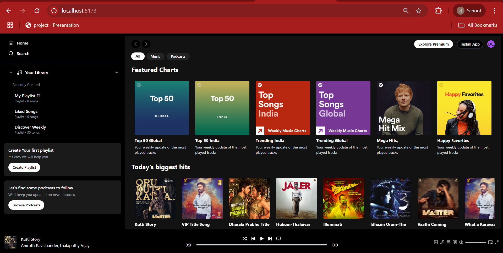
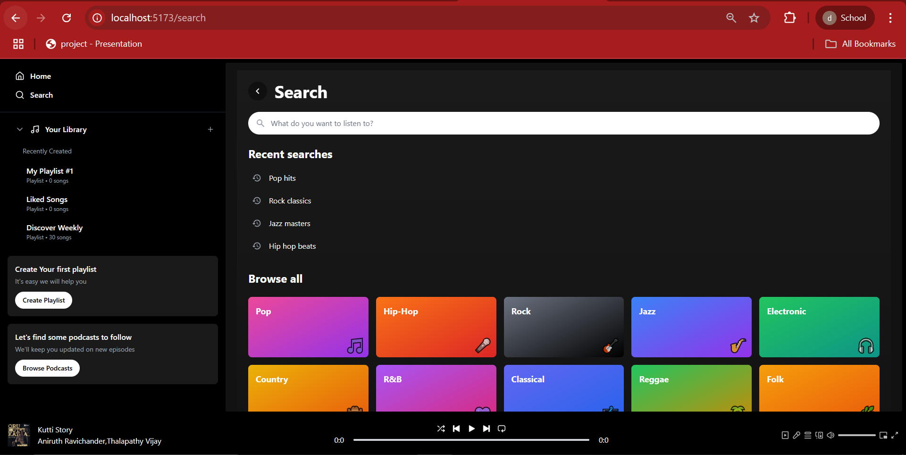
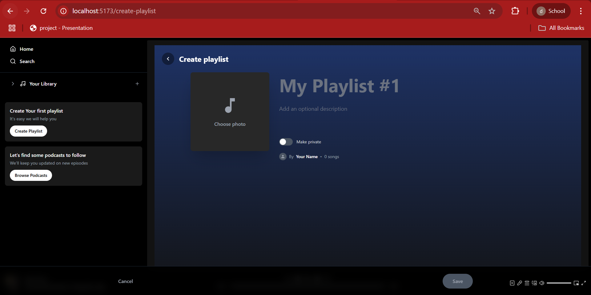
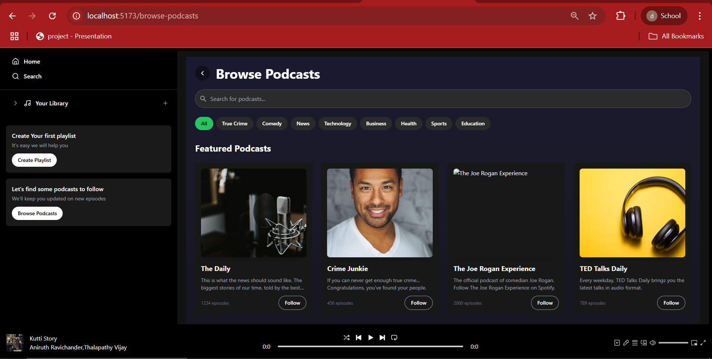
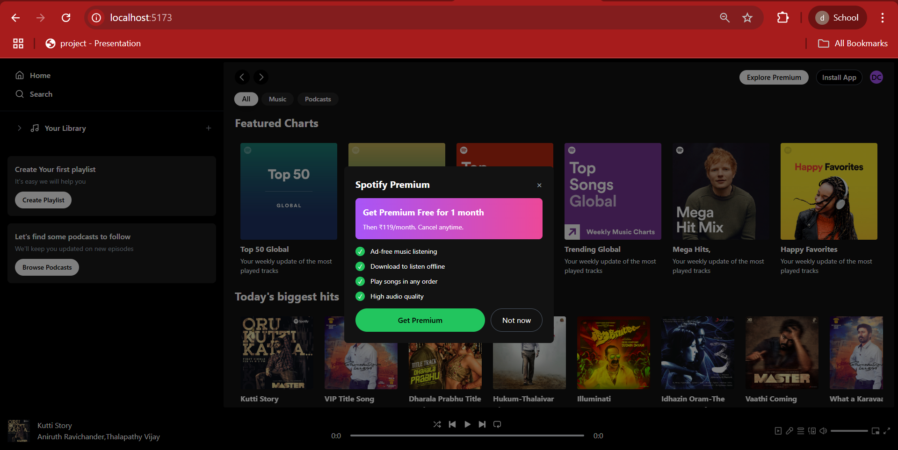
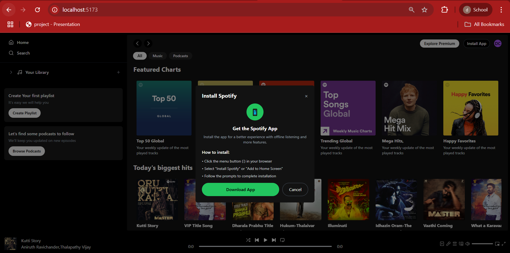

# Spotify 2.0 Clone - Music Streaming App

A fully responsive and interactive **Spotify 2.0 Clone** with enhanced features like playlist creation, album browsing, podcast section and a modern media player UI.

---

##  Week 5 Work - Core Features Implemented

##  Features

-  **Search Functionality** – Search songs, albums, artists, genres.
-  **Music Player** – With play/pause, next/prev, volume control, repeat, full-screen player.
-  **Playlists** – Create, view, and manage personal playlists.
-  **Albums & Artists** – Explore music by albums and artists.
-  **Genres** – Discover music by different genres.
-  **Explore Premium** – Visual section to promote Spotify Premium.
-  **Install App Option** – For Progressive Web App support.
-  **Sound On/Off** – Toggle mute and adjust volume levels.

##  Week 6 Work - New Components Added

- **My Playlist Component** – View user-created playlists in a personalized section.
- **Liked Songs Component** – Shows all songs liked by the user.
- **Discovered Songs Component** – Recommends newly discovered tracks.

---

##  Screenshots

###  Home Page

###  Search Page

###  Create Playlist

###  Browse Podcasts

###  Explore Premium

###  Install App Option

---

##  Player Functionalities

- Fullscreen Mode
- Sound On/Off
- Animated song progress bar
- Auto play next

---

## Install Dependencies
- npm install

## Start the Application
- npm run dev
